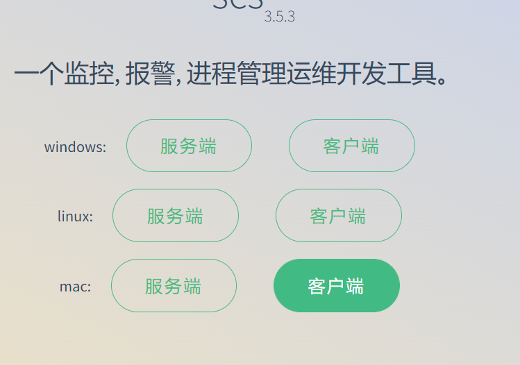
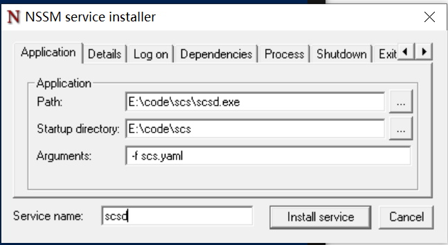

# 安装


## 二进制文件安装（版本可能会落后下面2种安装方式一个版本）

> 下载对应系统的服务器端和客户端二进制文件，客户端复制到 `C:\Windows\System32\` 目录下
```shell
# mac或linux 只要给执行文件即可运行，  windows 双击
# 客户端除了增加执行权限外还需要需要加入到PATH中, 出现类似下面的界面即可
[root@localhost scs]# scsctl status
<node: localhost, url: https://127.0.0.1:11111>
--------------------------------------------------
PName    Name    Status    Pid    UpTime    Version    CanNotStop  Failed    Disable   CPU       MEM(kb)   Command
```


## 自动安装
linux(需要 git tar命令， 关闭selinux),mac, windows 请按照使用二进制安装或自行编译安装
```
/bin/bash -c "$(curl -fsSL http://download.hyahm.com/scs.sh)"
```

## 手动安装 

> 依赖
- git  如果有没有此命令则需要安装git
- go >= 1.18
从中文网下载对应系统的包，解压后将 go/bin 添加到环境变量， 敲下 go 如果有如初则安装完go  

> 下载源码
```
mkdir /data
cd /data
git clone https://github.com/hyahm/scs.git

```
> 打包成二进制文件
```
cd scs
export GOPROXY=https://goproxy.cn  # 国内需要加个代理
go build -o scsd cmd/scsd/scsd.go  # 服务器端
go build -o /usr/local/bin/scsctl cmd/scsctl/scsctl.go  # 服务器端

# 拷贝配置文件模板
cp default.yaml /etc/scs.yaml  # 拷贝配置文件

```

## windows自启服务设置
进入nssm下载地址： http://www.nssm.cc/download  
下载最新的 `nssm 2.24 (2014-08-31) 版本`  
解压出 `nssm.exe` 文件出来， 放到 `C:\Windows\System32\` 目录下 
以管理员的身份打开当前路径的powershell, 执行
```
nssm.exe install
```
将出现下面类似下面的图形界面 ， 请更改为自己scsd所在的文件对应位置,保存即可    



## linux自启服务设置

```
systemd 文件
[Unit]
Description=Scs Service Control Script
After=network.target
After=network-online.target
Wants=network-online.target

[Service]
LimitNOFILE=6553500
LimitNPROC=6553500
WorkingDirectory=/data/scs
ExecStart=/data/scs/scsd -f /etc/scs.yaml
ExecStop=/bin/kill -s QUIT $MAINPID
Type=simple

[Install]
WantedBy=multi-user.target

# 拷贝启动脚本
# 配置文件里面的目录请求改成自己对应的
cp init/scsd.service /etc/systemd/system/scsd.service  
systemctl start scsd  # 启动服务
systemctl enable scsd   # 开机自启
```

## mac os自启服务设置

```
<?xml version="1.0" encoding="UTF-8"?>
<!DOCTYPE plist PUBLIC "-//Apple//DTD PLIST 1.0//EN" "http://www.apple.com/DTDs/PropertyList-1.0.dtd">
<plist version="1.0">
  <dict>
    <key>KeepAlive</key>
    <dict>
      <key>SuccessfulExit</key>
      <false/>
    </dict>
    <key>Label</key>
    <string>scsd</string>
    <key>ProgramArguments</key>
    <array>
      <string>./scsd</string>
      <string>-f</string>
      <string>scs.yaml</string>
    </array>
    <key>RunAtLoad</key>
    <true/>
    <key>WorkingDirectory</key>
    <string>/Users/cander/scs</string>
    <key>StandardErrorPath</key>
    <string>/Users/cander/scs/log/out.log</string>
    <key>StandardOutPath</key>
    <string>/Users/cander/scs/log/out.log</string>
  </dict>
</plist>


# 拷贝启动脚本,注意权限，参考`~/Library/LaunchAgents/`目录下的文件权限
# 配置文件里面的目录请求改成自己对应的
cp init/scsd.plist ~/Library/LaunchAgents/
# 加载一下，无视错误
launchctl load ~/Library/LaunchAgents/scsd.plist
launchctl start scsd  # 启动服务
```

## 指定配置文件
配置详情参考[scs.yaml](/config.md)
```
./scsd -f scs.yaml
```

## 查看版本（很重要）

客户端和服务端的版本最好保持一直， 有可能会有稍稍不一样
```
scsctl -v
scsd -v
```